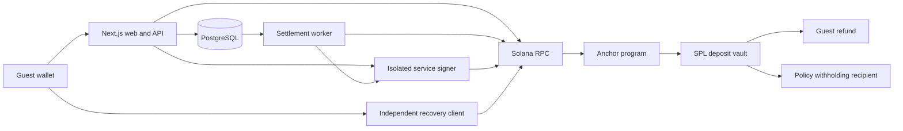

# AttendBack — Show up. Get your deposit back.

[](https://github.com/ernur077sss-art/AttendBack/actions/workflows/check.yml)
[](https://attendback-three.vercel.app/)
[](docs/architecture.ru.md)
[](docs/progress.ru.md)
[](https://superteam.fun/earn/listing/colosseum-crypto-worlds-fair-hackathon-superteam-kazakhstan-track)

> Refundable attendance deposits for events on Solana. Guests reserve a seat, check in with a QR ticket, and receive their deposit back under rules published before payment.

**Live demo on Vercel: [attendback-three.vercel.app ↗](https://attendback-three.vercel.app/)**

[Русский](README.ru.md) · [Demo walkthrough](docs/demo.ru.md) · [Architecture](docs/architecture.ru.md) · [Development plan](hackathon-product-plan/development-plan.ru.md) · [Release status](docs/progress.ru.md)

**Current release:** [public devnet beta](https://attendback-three.vercel.app), hosted on Vercel Hobby + Neon Free. An actual hosted API flow has verified publication, a 1 test-USDC deposit, QR-token check-in, and a finalized automatic refund. Regular-wallet and physical-phone checks, the final video, and submission remain pending.

**Interface languages:** [English](https://attendback-three.vercel.app/?lang=en) · [Русский](https://attendback-three.vercel.app/?lang=ru). Use **RU / EN** in the header; your choice is saved for future visits. Event content stays as written by the organizer. The recovery page supports both languages too.

The [recovery client](https://attendback-recovery.vercel.app) is live. The web/API, isolated signer, database, and durable Workflow are deployed; see [deployment status and setup](docs/free-hosting.ru.md).

---


_Actual local demo: event registration, deposit amount, cancellation terms, dispute deadlines, and the protective refund deadline. The event is synthetic; it does not represent a partnership._

---

## Hackathon project

Prepared for [Colosseum Crypto Worlds Fair — Superteam Kazakhstan track](https://superteam.fun/earn/listing/colosseum-crypto-worlds-fair-hackathon-superteam-kazakhstan-track). The hackathon application has not been submitted yet.

| Account         | Role          | Contact                                      |
| --------------- | ------------- | -------------------------------------------- |
| ernur077sss-art | Project owner | [GitHub](https://github.com/ernur077sss-art) |

AttendBack serves organizers of conferences, community meetups, workshops, and innovation hub events. It includes its own registration flow and does not require a particular ticketing platform.

---

## Problem and Solution

### 1. Reserved seats can stay empty

- **Problem:** A free registration does not necessarily become an attended event.
- **AttendBack:** A refundable deposit gives guests a commitment to keep. A FIFO waitlist offers released seats to the next guest without charging them automatically.

### 2. Refund terms can be unclear

- **Problem:** Guests may not know who holds their deposit or when they can recover it.
- **AttendBack:** The published policy fixes the amount, token, recipient, deadlines, and withholding share. Deposits are held in program-controlled SPL vaults, with finalized transaction receipts.

### 3. Attendance and disputes require accountability

- **Problem:** A missed or incorrect check-in can turn into a payment dispute.
- **AttendBack:** Staff scan QR tickets, corrections have an audit trail, and a guest can open a dispute within the policy window. A designated resolver decides the outcome under the published rules.

### 4. The application can go offline

- **Problem:** An unavailable backend should not be the only way to access an eligible refund.
- **AttendBack:** An independent recovery client reads Solana directly and prepares a full refund when the deposit is refundable, the event is cancelled, or the protective deadline has passed.

Reducing no-shows is a product hypothesis, not a measured result. A pilot should measure attendance, deposit conversion, waitlist fill rate, and dispute frequency.

---

## Why Solana

- **Enforceable settlement:** an Anchor program validates the policy, authorities, deadlines, and payment destinations.
- **SPL token deposits:** each commitment has a separate vault; a split settlement transfers the refund and withheld amount atomically.
- **Verifiable receipts:** the ledger records finalized on-chain payments rather than treating a queued job as a completed refund.
- **Independent recovery:** the guest can use a separate client and RPC without the AttendBack API, database, or worker.

The chain enforces payment rules. Staff still attest physical attendance, the resolver decides disputes, and the upgrade authority controls program updates. See the [protocol and trust boundaries](docs/protocol.ru.md).

---

## Summary of Features

- Organizer workspace with events, sessions, staff roles, and published deposit policies.
- Wallet sign-in, seat reservations, FIFO waitlist, and QR tickets.
- Attendance refunds, early cancellation, late cancellation, and no-show handling.
- Private dispute evidence, a resolver workspace, and fixed dispute windows.
- Check-in history with authors, timestamps, and correction revisions.
- Settlement worker with retries, transaction reconciliation, and in-app notifications.
- A separate recovery application and an isolated signer service deployed for devnet.

---

## Tech Stack

| Layer                | Technology                                                     |
| -------------------- | -------------------------------------------------------------- |
| On-chain program     | Rust 1.99.0 · Anchor 1.2.1 · Agave 4.3.0 · SPL Token           |
| Client and wallet    | TypeScript 7.0.2 · Solana Kit 8.4.0 · Codama · Wallet Standard |
| Frontend and API     | Next.js 16.4.0 · React 19.3.0 · Tailwind CSS 4.3.3             |
| Data and jobs        | PostgreSQL 18.4 · Node.js 24.19.0 · transactional outbox       |
| Recovery and signing | Vite 8.3.3 · separate Node.js signer                           |
| Testing and tooling  | LiteSVM · Surfpool 1.6.0 · Vitest · Playwright · pnpm 11.25.0  |

---

## Architecture



The backend assigns seats and access rights; Solana determines the permitted payment outcome. Attendance refunds keep the ticket active, while confirmed cancellation releases the seat. The separate signer is implemented for devnet; localnet uses public test roles.

Full component breakdown: [architecture](docs/architecture.ru.md) · [signer service](docs/signer.ru.md).

---

## Quick Start

**Prerequisites:** Node.js 24.19.0, pnpm 11.25.0, Rust 1.99.0, Anchor CLI 1.2.1, and Agave/Solana CLI 4.3.0 installed and available on `PATH`.

### 1. Install and build

```sh
git clone https://github.com/ernur077sss-art/AttendBack.git
cd AttendBack
pnpm install --frozen-lockfile
NO_DNA=1 anchor build
pnpm codegen
```

The local defaults match [.env.example](.env.example); no credentials are needed for the synthetic demo. Custom server values must be exported into each process environment. Next.js reads its local env file from `apps/web/.env.local`.

### 2. Start PostgreSQL

Run in a dedicated terminal and keep it open:

```sh
pnpm db:start
```

Alternatively, run `docker compose up -d db`. Choose one database option; both use port `54329`.

### 3. Migrate and start the local chain

In another terminal, after PostgreSQL is ready:

```sh
pnpm db:migrate
pnpm localnet
```

Keep the chain running. Restarting it resets on-chain state but preserves the database; create a new demo event after a restart.

### 4. Start the application and worker

Run each command in its own terminal, from the repository root:

```sh
pnpm dev
```

```sh
pnpm worker
```

Once the services are ready, create a demo event:

```sh
pnpm demo:seed
```

Open [localhost:3000](http://127.0.0.1:3000) or the event URL printed by the seed command. The wallet menu provides labeled local roles for organizer, guest, staff, and resolver. These use public test keys and tokens with no monetary value. Never send real funds to them.

For the existing Codex workspace, `./scripts/pnpmw` can replace `pnpm`; `source scripts/toolchain.sh` selects its already installed local Rust/Solana tools. Those ignored tool directories are not included in a fresh clone.

### Independent recovery

```sh
pnpm recovery:build
pnpm recovery:start
```

Open [localhost:4173](http://127.0.0.1:4173), enter the RPC URL and the deposit address from the ticket, then connect the guest wallet. Recovery requires an eligible on-chain state, an available RPC, and a fee payer with SOL. The static build in `apps/recovery/dist` can be hosted separately.

---

## Tests and Verification

The bilingual release passed **52 automated tests and 10 browser scenarios**, plus TypeScript checks and both production builds. [GitHub CI for the deployed code](https://github.com/ernur077sss-art/AttendBack/actions/runs/37904855966) also passed the program build and PostgreSQL/RPC checks. Earlier database restoration checks are recorded in the [audit](docs/plan-audit.ru.md); current results are in the [progress log](docs/progress.ru.md).

With PostgreSQL and localnet running:

```sh
pnpm exec node --import tsx scripts/test-db.ts
pnpm check
pnpm test:db
pnpm recovery:build
pnpm exec playwright install --with-deps chromium
pnpm test:e2e
```

Tests use a separate `_test` database; browser tests start their own web application on port `3001`. `pnpm db:backup-check` additionally requires `pg_dump` and `pg_restore` 18.4 in `.local/toolchain/postgres-client/bin`. These checks do not replace an independent security audit.

---

## Roadmap

- [x] Stages 1–2: local foundation, data model, and deposit rules.
- [x] Stages 3–4: Solana deposits, refunds, no-shows, and disputes.
- [x] Stages 5–6: reservations, roles, settlement worker, and reconciliation.
- [x] Stage 7: local interfaces, QR check-in, and independent recovery.
- [ ] Stage 7: verify a physical phone camera over public HTTPS.
- [x] Stage 8: local automated tests, regression fixes, and database restoration.
- [x] Stage 9 preparation: release configuration, signer, manifest, and demo script.
- [x] Stage 9: deploy to devnet, host the services, and verify an automatic refund through the hosted API.
- [ ] Stage 9: verify a regular wallet, physical phone, and the public recovery flow.
- [ ] Publish the final demo video and submit the hackathon application.

Full roadmap: [approved development plan](hackathon-product-plan/development-plan.ru.md). The current release does not support mainnet or real funds. Card/tenge payments, SSO, external registration integrations, and email/SMS are outside this MVP.

---

## Resources

- [Vercel deployment setup](docs/vercel.ru.md) — web/API and an independent recovery project.
- [Product specification](hackathon-product-plan/product-plan.ru.md)
- [Demo walkthrough](docs/demo.ru.md)
- [Architecture](docs/architecture.ru.md) and [payment protocol](docs/protocol.ru.md)
- [Devnet release checklist](docs/devnet-release.ru.md)
- [Verified progress](docs/progress.ru.md) and [plan audit](docs/plan-audit.ru.md)
- [Runtime notes](docs/runtime-notes.ru.md)
- [GitHub Actions](https://github.com/ernur077sss-art/AttendBack/actions/workflows/check.yml)

Technical documents are primarily in Russian. The application and recovery client support **Russian and English**, with a persistent **RU / EN** selector. The public demo is linked above; presentation and video are still pending.

---

## License

No `LICENSE` file is included in this repository yet.
