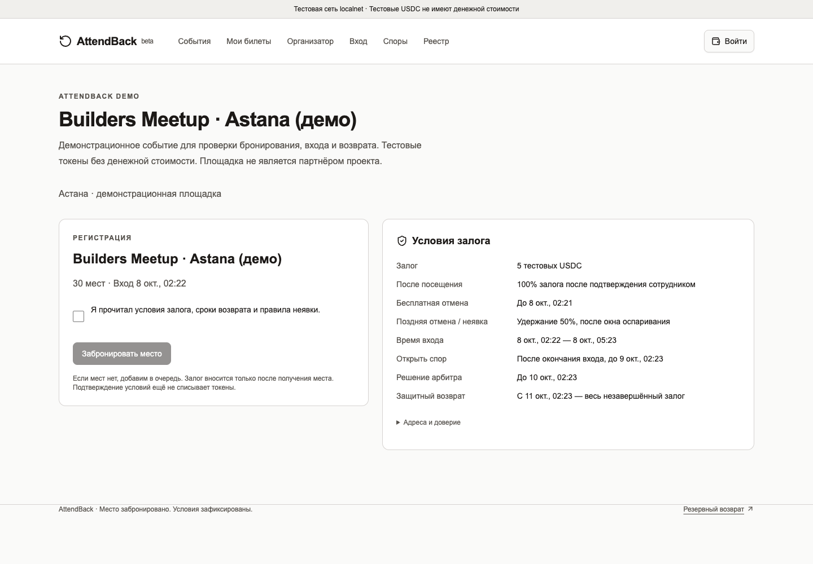
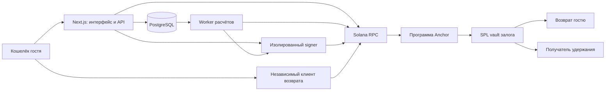

# AttendBack — Приходите. Залог вернётся.

[](https://github.com/ernur077sss-art/AttendBack/actions/workflows/check.yml)
[](docs/architecture.ru.md)
[](docs/progress.ru.md)
[](https://superteam.fun/earn/listing/colosseum-crypto-worlds-fair-hackathon-superteam-kazakhstan-track)

> Возвратные залоги за посещение мероприятий на Solana. Гость бронирует место, проходит по QR-билету и получает залог обратно по правилам, опубликованным до оплаты.

[English](README.md) · [Сценарий демо](docs/demo.ru.md) · [Архитектура](docs/architecture.ru.md) · [План разработки](hackathon-product-plan/development-plan.ru.md) · [Статус релиза](docs/progress.ru.md)

**Текущая версия:** рабочий локальный MVP с тестовыми токенами. Публичное размещение в devnet, доступное по ссылке приложение и итоговый видеоролик ещё готовятся.

---



_Реальный скриншот локального демо: регистрация, сумма залога, условия отмены, сроки спора и защитного возврата. Событие демонстрационное и не означает партнёрство с площадкой._

---

## Проект для хакатона

Подготовка к [Colosseum Crypto Worlds Fair — Superteam Kazakhstan track](https://superteam.fun/earn/listing/colosseum-crypto-worlds-fair-hackathon-superteam-kazakhstan-track). Заявка на хакатон пока не отправлена.

| Аккаунт         | Роль             | Контакт                                      |
| --------------- | ---------------- | -------------------------------------------- |
| ernur077sss-art | Владелец проекта | [GitHub](https://github.com/ernur077sss-art) |

AttendBack подходит организаторам конференций, митапов, мастер-классов и мероприятий инновационных хабов. В продукте есть собственная регистрация; конкретная билетная площадка не обязательна.

---

## Проблема и решение

### 1. Забронированные места остаются пустыми

- **Проблема:** Бесплатная регистрация не гарантирует посещение.
- **AttendBack:** Возвратный залог помогает гостю принять обязательство прийти. Очередь FIFO предлагает освободившееся место следующему участнику без автоматического списания.

### 2. Условия возврата непонятны

- **Проблема:** Гость может не знать, кто хранит залог и когда его можно вернуть.
- **AttendBack:** Опубликованная политика фиксирует сумму, токен, получателя, сроки и долю удержания. Залог хранится в SPL-vault под управлением программы, а расчёт подтверждается finalized-квитанцией.

### 3. Отметки о посещении и споры требуют прозрачности

- **Проблема:** Пропущенный или ошибочный check-in может привести к спору о деньгах.
- **AttendBack:** Сотрудник сканирует QR, история сохраняет исправления и их авторов. Гость может открыть спор в установленное окно, а назначенный арбитр принимает решение в рамках опубликованных правил.

### 4. Приложение может стать недоступным

- **Проблема:** Возврат не должен зависеть только от доступности основного backend.
- **AttendBack:** Независимый клиент читает Solana напрямую и готовит полный возврат, когда залог получил право возврата, событие отменено или наступил защитный срок.

Снижение неявок — продуктовая гипотеза, а не измеренный результат. В пилоте нужно проверить посещаемость, конверсию в залог, заполнение мест из очереди и частоту споров.

---

## Почему Solana

- **Проверяемые правила расчёта:** программа Anchor проверяет политику, полномочия, сроки и адреса получателей.
- **Залоги в SPL-токене:** для каждого депозита создаётся отдельный vault; возврат и удержание переводятся атомарно.
- **Квитанции из сети:** реестр показывает finalized-платёж, а не выдаёт поставленное в очередь задание за завершённый возврат.
- **Независимое восстановление:** гость может использовать отдельный клиент и RPC без API, базы данных и worker AttendBack.

Блокчейн ограничивает денежный исход. Физическое посещение подтверждает сотрудник, спор решает арбитр, а обновлением программы управляет upgrade authority. Подробнее — в [протоколе и границах доверия](docs/protocol.ru.md).

---

## Возможности

- Кабинет организатора: события, сессии, роли сотрудников и опубликованные политики залога.
- Вход через кошелёк, бронирование мест, очередь FIFO и QR-билеты.
- Возврат за посещение, ранняя и поздняя отмена, обработка неявок.
- Приватные доказательства, кабинет арбитра и фиксированные сроки споров.
- Журнал check-in с авторами, временем и версиями исправлений.
- Worker расчётов: повторные попытки, сверка транзакций и уведомления внутри приложения.
- Отдельное приложение возврата и изолированный сервис подписи для будущего devnet-релиза.

---

## Технологический стек

| Слой                   | Технологии                                                     |
| ---------------------- | -------------------------------------------------------------- |
| Программа Solana       | Rust 1.99.0 · Anchor 1.2.1 · Agave 4.3.0 · SPL Token           |
| Клиент и кошелёк       | TypeScript 7.0.2 · Solana Kit 8.4.0 · Codama · Wallet Standard |
| Интерфейс и API        | Next.js 16.4.0 · React 19.3.0 · Tailwind CSS 4.3.3             |
| Данные и задания       | PostgreSQL 18.4 · Node.js 24.19.0 · транзакционный outbox      |
| Возврат и подпись      | Vite 8.3.3 · отдельный Node.js signer                          |
| Проверки и инструменты | LiteSVM · Surfpool 1.6.0 · Vitest · Playwright · pnpm 11.25.0  |

---

## Архитектура



Backend распределяет места и права доступа, а Solana определяет допустимый денежный исход. Возврат за посещение сохраняет активный билет; подтверждённая отмена освобождает место. Отдельный signer реализован для devnet, а localnet использует публичные тестовые роли.

Подробная схема: [архитектура](docs/architecture.ru.md) · [сервис подписи](docs/signer.ru.md).

---

## Быстрый запуск

**Требования:** Node.js 24.19.0, pnpm 11.25.0, Rust 1.99.0, Anchor CLI 1.2.1 и Agave/Solana CLI 4.3.0 установлены и доступны через `PATH`.

### 1. Установить зависимости и собрать программу

```sh
git clone https://github.com/ernur077sss-art/AttendBack.git
cd AttendBack
pnpm install --frozen-lockfile
NO_DNA=1 anchor build
pnpm codegen
```

Локальные значения по умолчанию совпадают с [.env.example](.env.example); для демонстрации секреты не нужны. Свои серверные значения нужно экспортировать в окружение каждого процесса. Next.js читает локальный env-файл из `apps/web/.env.local`.

### 2. Запустить PostgreSQL

В отдельном терминале, который нужно оставить открытым:

```sh
pnpm db:start
```

Альтернатива — `docker compose up -d db`. Выберите один способ: оба используют порт `54329`.

### 3. Применить миграции и запустить локальную сеть

В другом терминале, когда PostgreSQL готов:

```sh
pnpm db:migrate
pnpm localnet
```

Оставьте сеть работать. Её перезапуск очищает цепочку, но сохраняет базу данных; после перезапуска создайте новое демонстрационное событие.

### 4. Запустить приложение и worker

Каждую команду выполните в собственном терминале из корня репозитория:

```sh
pnpm dev
```

```sh
pnpm worker
```

После готовности сервисов создайте демонстрационное событие:

```sh
pnpm demo:seed
```

Откройте [localhost:3000](http://127.0.0.1:3000) или ссылку на событие из вывода команды. В меню кошелька доступны локальные роли организатора, участника, сотрудника и арбитра. Они используют публичные тестовые ключи и токены без денежной стоимости. Не переводите на них реальные средства.

В существующем workspace Codex вместо `pnpm` можно использовать `./scripts/pnpmw`, а `source scripts/toolchain.sh` подключает уже установленные локальные Rust/Solana CLI. Эти каталоги инструментов исключены из Git и не появляются при новом клонировании.

### Независимый возврат

```sh
pnpm recovery:build
pnpm recovery:start
```

Откройте [localhost:4173](http://127.0.0.1:4173), укажите RPC и адрес депозита из билета, подключите кошелёк гостя. Нужны допустимое состояние в сети, доступный RPC и SOL у плательщика комиссии. Статическую сборку `apps/recovery/dist` можно разместить отдельно.

---

## Тесты и проверки

Последнее зафиксированное локальное ревью: **30 тестов правил/программы/signer, 16 PostgreSQL/RPC-тестов и 7 браузерных сценариев**, обе production-сборки и восстановление всех 17 таблиц БД. Результаты — в [отчёте](docs/plan-audit.ru.md) и [журнале прогресса](docs/progress.ru.md). Бейдж CI в начале README показывает фактический статус GitHub workflow.

При работающих PostgreSQL и localnet:

```sh
pnpm exec node --import tsx scripts/test-db.ts
pnpm check
pnpm test:db
pnpm recovery:build
pnpm exec playwright install --with-deps chromium
pnpm test:e2e
```

Тесты используют отдельную БД с суффиксом `_test`; браузерные проверки поднимают своё web-приложение на порту `3001`. Для `pnpm db:backup-check` дополнительно нужны `pg_dump` и `pg_restore` 18.4 в `.local/toolchain/postgres-client/bin`. Эти проверки не заменяют независимый аудит безопасности.

---

## План развития

- [x] Этапы 1–2: локальная основа, модель данных и правила залога.
- [x] Этапы 3–4: депозиты Solana, возвраты, неявки и споры.
- [x] Этапы 5–6: места, роли, worker расчётов и сверка с сетью.
- [x] Этап 7: локальные интерфейсы, QR check-in и независимый возврат.
- [ ] Этап 7: проверка камеры физического телефона по публичному HTTPS.
- [x] Этап 8: локальные автотесты, исправления регрессий и восстановление БД.
- [x] Подготовка этапа 9: конфигурация релиза, signer, манифест и сценарий демо.
- [ ] Этап 9: размещение в devnet, публикация сервисов и проверка обычного кошелька.
- [ ] Публикация итогового видео и отправка заявки на хакатон.

Полный roadmap: [утверждённый план разработки](hackathon-product-plan/development-plan.ru.md). Текущая версия не поддерживает mainnet и реальные средства. Карты/тенге, SSO, внешние системы регистрации и email/SMS не входят в этот MVP.

---

## Материалы

- [Продуктовая спецификация](hackathon-product-plan/product-plan.ru.md)
- [Сценарий демонстрации](docs/demo.ru.md)
- [Архитектура](docs/architecture.ru.md) и [денежный протокол](docs/protocol.ru.md)
- [Порядок devnet-релиза](docs/devnet-release.ru.md)
- [Проверенный прогресс](docs/progress.ru.md) и [сверка с планом](docs/plan-audit.ru.md)
- [Особенности окружения](docs/runtime-notes.ru.md)
- [GitHub Actions](https://github.com/ernur077sss-art/AttendBack/actions/workflows/check.yml)

Техническая документация и текущий интерфейс преимущественно на русском языке. Ссылки на публичное приложение, презентацию и видео появятся после публикации этих материалов.

---

## Лицензия

Файл `LICENSE` пока не добавлен в репозиторий.
