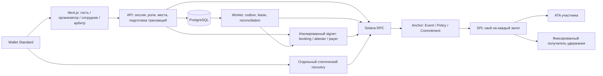

# AttendBack — архитектура реализации

Сервер распределяет места и права доступа. Программа Solana определяет допустимый денежный исход. Билет, место и залог имеют разные состояния: посещение и расчёт не освобождают место, подтверждённая отмена освобождает.

## Путь гостя

1. Одноразовый challenge подписывается кошельком. Сервер сохраняет хеш сессионного токена; браузер получает HttpOnly/SameSite cookie.
2. При резервировании сервер блокирует строку сессии и считает занятые места. Очередь FIFO, предложение на 10 минут.
3. Подготовка депозита сверяет опубликованную политику с finalized аккаунтами. Booking signer подписывает конкретную транзакцию с гостем, суммой, mint, permit и blockhash. Сервер сохраняет PaymentPending до выдачи транзакции клиенту.
4. Гость видит условия и результат симуляции. После подписи сервер проверяет неизменность сообщения и все подписи, сохраняет байты до отправки.
5. Только finalized состояние выдаёт активный билет. QR — короткоживущий секрет с хешем в БД, не приватный ключ.
6. Сотрудник может исправить check-in 30 секунд. Worker фиксирует ревизию перед on-chain attestation и выдаёт право возврата. Повторная отметка и повторное задание не создают второй расчёт.
7. Расчёт — атомарные SPL-переводы в фиксированные ATA. Реестр содержит фактическую finalized подпись, сумму возврата и удержания.

## Сбои и повторная доставка

Outbox имеет уникальный ключ, lease и сохранённые подписанные байты. После остановки worker сначала проверяет подпись и актуальное состояние, затем при необходимости отправляет те же байты. Новая транзакция создаётся только после доказанного истечения предыдущей. Незавершённая проекция подтверждённой операции повторяется.

PaymentPending не освобождается при ошибке RPC. Для освобождения нужны истёкшие permit и blockhash, а также finalized отсутствие депозита с достаточным context slot. Сроки действий задаёт Clock Solana; срок cookie, резерва и 30 секунд исправления — серверные часы.

## Данные и доверие

События, организации, роли, очередь, check-in и уведомления хранятся в PostgreSQL. Текст спора и файлы доступны гостю и назначенному арбитру. До пяти файлов по 2 MiB; после решения добавление закрывается; истёкшие через 30 дней файлы удаляет worker. Пользовательские ключи приложение не получает.

Booking authority распределяет места; attester удостоверяет физический вход; resolver решает спор. Эти факты не доказываются блокчейном. Upgrade authority может изменить программу. Правила возврата, доверия, rent и комиссии показаны до подписи. Для devnet реализован отдельный процесс `apps/signer`: сверка разрешённого сообщения с on-chain состоянием, симуляция и подпись. Служебные ключи поставляются только этому процессу через защищённые mount-файлы; публичные localnet seeds там запрещены. Размещение и конфигурация описаны в [signer.ru.md](signer.ru.md).

Recovery не импортирует серверные модули и не обращается к API AttendBack. Для полного возврата проверяет отмену события, Refundable либо hard_refund_at. Его нужно размещать независимо и распространять исходники/IDL вместе с релизом.
